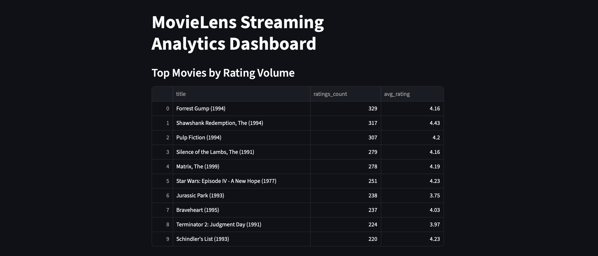

# Streaming Analytics Pipeline & Dashboard

This project demonstrates an end-to-end analytics workflow using Python, PostgreSQL, and Streamlit. Raw MovieLens datasets are ingested, transformed into structured analytics tables, and queried to produce insights on user activity, rating trends, and genre performance.

The final output is an interactive Streamlit dashboard that visualizes:

- Top movies by rating volume and average score
- Daily engagement metrics over time
- Genre-level performance comparisons

This project simulates a real data engineering and analytics pipeline, showcasing database design, SQL querying, and dashboard development in a production-style workflow.

---

## Dashboard Preview

Example Streamlit dashboard displaying movie rating trends and engagement metrics.

---

## Skills Demonstrated

- Data cleaning and transformation with Pandas  
- SQL-style analytics queries on rating datasets  
- Data pipeline workflow from ingestion to visualization  
- Interactive dashboard development using Streamlit  
- Data visualization of user engagement and rating trends  

---

## Dataset

This project uses the **MovieLens dataset** provided by the GroupLens Research Lab.

https://grouplens.org/datasets/movielens/

---

## What this project does

- Loads raw MovieLens CSV files  
- Cleans and transforms the data into analysis-friendly tables  
- Produces metrics like top movies by rating volume, average ratings, and daily activity trends  
- Displays results in a Streamlit dashboard  

---

## Tech Stack

- Python  
- Pandas  
- Streamlit  
- PostgreSQL (optional depending on your setup)  

---

## Project Structure
